<h2 align="center" style="color:#38c2bb;">📚 PS SnapShot</h2>

  <a href="https://github.com/Power-Source/ps-snapshot/releases" style="color:#38c2bb;">DOWNLOAD</a>
  <a href="https://github.com/Power-Source/ps-snapshot-installer/releases/tag/1.0.1" style="color:#38c2bb;">RESTORE SKRIPT</a>

## 1.1 Dashboard

Das PS Snapshot Dashboard gibt dir einen Überblick über deine geplanten Backups, mit welchen Drittanbieter-Zielen du verbunden bist und wann dein letztes Backup erstellt wurde.

**Letzter Snapshot** – Zeigt das Datum und die Uhrzeit deines letzten erfolgreichen Backups an
**Verfügbare Speicherorte** – Die Anzahl der Orte, wo deine Backups gespeichert werden können. Eine ausführliche Erklärung zu den Zielen und wie du sie konfigurierst, findest du im Abschnitt „Ziele" in dieser Anleitung.
**Backup-Plan** – Zeigt an, zu welcher Tageszeit deine Backups täglich geplant sind.

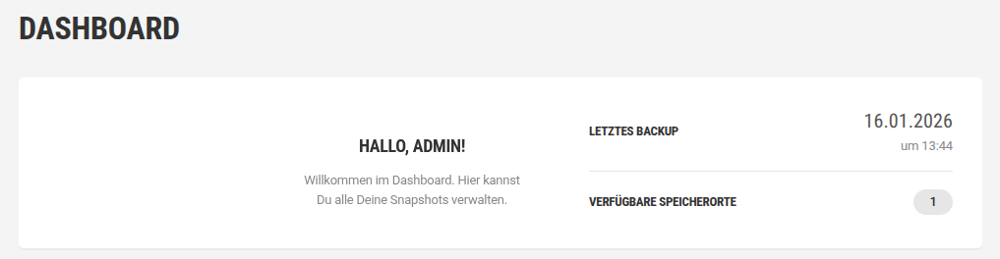

## 1.2 Snapshots

In Snapshots konfigurierst und führst du Backups aus – entweder auf Abruf oder in regelmäßigen Abständen – um alle oder eine benutzerdefinierte Auswahl von Dateien und Datenbanktabellen einzubeziehen.

Klick auf die Schaltfläche **Snapshot erstellen**, um den Snapshot-Assistenten zu öffnen.

### Anforderungen überprüfen

Snapshots können nicht für eine Website erstellt werden, die die Anforderungsprüfung nicht bestanden hat. Diese Prüfung verifiziert, dass die erforderlichen Apps und Einstellungen vorhanden und auf dem neuesten Stand sind, und bietet empfohlene Maßnahmen, wenn die Mindestanforderungen nicht erfüllt sind:

**PHP-Version** – PS Snapshot benötigt PHP Version 5.5 oder höher. Wenn dein Host eine ältere PHP-Version verwendet, zeigt PS Snapshot eine Warnung zur niedrigen oder veralteten PHP-Version an. Du musst deine PHP-Version aktualisieren, um fortzufahren.
**Max. Ausführungszeit** – Eine Mindestausführungszeit von 150 Sekunden wird empfohlen, um dem Backup-Prozess die beste Chance zum Erfolg zu geben. Wenn du einen verwalteten Host verwendest, kontaktiere ihn direkt, um es aktualisieren zu lassen.
**MySQLi** – Snapshot benötigt das MySQLi-Modul, das auf dem Zielserver installiert und aktiviert sein muss. Wenn du einen verwalteten Host verwendest, kontaktiere ihn direkt, um dieses Modul installieren und aktivieren zu lassen.
**PHP Zip** – Um die von Snapshot erstellte ZIP-Datei zu entpacken, muss das PHP-Zip-Modul installiert und aktiviert sein. Wenn du einen verwalteten Host verwendest, kontaktiere ihn direkt, um es hinzufügen oder aktualisieren zu lassen.
Wenn deine Website die Prüfung nicht besteht, behebe die Mängel und klick auf „Erneut überprüfen". Sobald die Anforderungsprüfung bestanden ist, fahre mit der Konfiguration eines Snapshots fort.

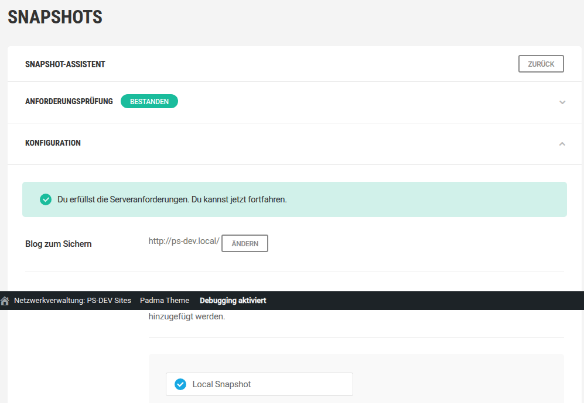

### Konfiguration

#### Ziel

Ein Ziel ist ein Ort, wo Snapshot-Backups gespeichert werden. Es gibt zwei Formen: lokal und remote (Drittanbieter). Snapshot erstellt beim Aktivieren des Plugins automatisch ein lokales Standardziel, aber Remote-Speicherorte müssen mit Snapshot verbunden werden, bevor Backups dort gespeichert werden können.

Verbundene Speicherorte erscheinen als Optionen auf dem Snapshot-Konfigurationsbildschirm. Es können mehrere Speicherorte verbunden werden, aber für jeden Snapshot kann nur ein Ziel verwendet werden.

#### Lokaler Snapshot

Das von Snapshot erstellte Standardziel für lokale Backups ist ein Verzeichnis auf demselben Server, auf dem deine Website gehostet ist. Weitere Informationen zum Verwenden und Ändern dieses Standard-Lokalziels findest du in unserem Leitfaden im Abschnitt „Ziele" unten.

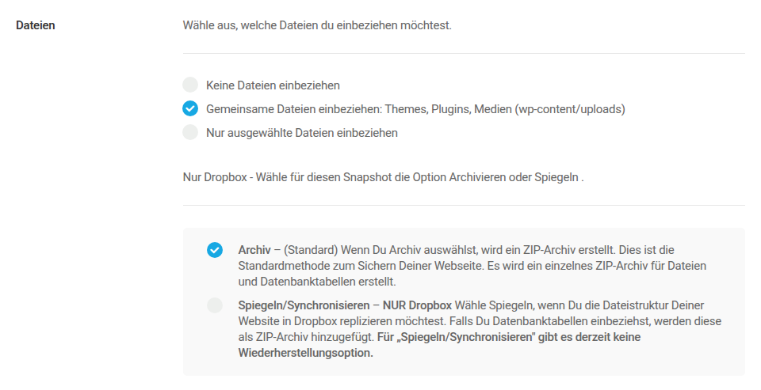

Wir empfehlen nicht, deinen lokalen Server als einzigen Backup-Speicherort zu verwenden, aus Sicherheitsgründen, die im Abschnitt „Ziel" in dieser Anleitung erörtert werden. Stattdessen empfehlen wir, mindestens ein Remote-Ziel zu verbinden und es als dein primäres Backup-Ziel zu verwenden.

Siehe den Abschnitt „Ziele" in dieser Anleitung unten, wenn du ändern möchtest, wo deine lokalen Backups gespeichert werden, oder wenn du ein Remote-Ziel verbinden musst, bevor du fortfährst.

#### Verzeichnis

Dieses Feld ist optional und kann verwendet werden, um den Ordner zu ändern, in dem dein Backup gespeichert wird, oder um dynamische Werte hinzuzufügen, um den Bucket/das Verzeichnis, die Website-Domain oder die ID anzupassen.

Das Standard-Lokalverzeichnis ist auf public_html/wp-content/uploads/snapshots/ eingestellt, kann aber während der Konfiguration geändert werden, um ein Backup an anderer Stelle auf deinem lokalen Server zu speichern, indem du „Benutzerdefiniertes Verzeichnis verwenden" wählst und das bevorzugte Verzeichnis in das bereitgestellte Feld eingibst.

#### Dateien

Dieses Modul ermöglicht dir, auszuwählen, welche Dateien PS Snapshot in dein Backup aufnimmt. Diese Optionen gelten nur für Dateien, nicht für die Datenbank. Ähnliche Optionen für Datenbanktabellen findest du im Abschnitt „Datenbank".

**Keine Dateien einbeziehen** – Diese Option sichert nur die Datenbank und schließt alle Design-, Plugin- und Mediendateien aus.
**Allgemeine Dateien einbeziehen** – Bezieht alle Designs, Plugins und Mediendateien in den wp-content- und uploads-Ordnern ein.
**Nur ausgewählte Dateien einbeziehen** – Wähle diese Option, um eine Liste anzuzeigen, aus der du auswählen kannst, welche Dateien in dein Backup aufgenommen werden sollen.

#### Nur Dropbox Option

Standardmäßig werden alle Snapshots mit der traditionellen Archiv-Option erstellt, die eine einzelne ZIP-Version deiner Website mit allen Dateien und Datenbanktabellen erstellt. Wenn Dropbox allerdings das Ziel ist, repliziert die Spiegel-/Sync-Option die Dateistruktur der Website, damit sie in Dropbox angezeigt werden kann. Nur die Datenbank wird gezippt. Es ist wichtig zu wissen, dass Spiegel-/Sync-Backups nicht mit der One-Click-Restore-Funktion von Snapshot wiederhergestellt werden können, sondern manuell wiederhergestellt werden müssen.

#### URL-Ausschlüsse

Jede Datei im WordPress-Verzeichnis hat eine eigene URL. Du kannst jede einzelne Datei von deinem Backup ausschließen, indem du die URL in das bereitgestellte Feld eingibst. URLs müssen zeilenweise eingegeben werden.

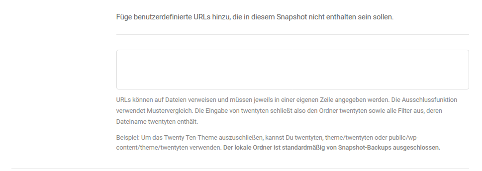

#### Datenbank

Dieses Modul ermöglicht dir, auszuwählen, welche Datenbanktabellen in dein Backup aufgenommen werden sollen. Die Optionen „Alles einbeziehen" und „Nichts einbeziehen" erklären sich selbst.

Um eine benutzerdefinierte Auswahl von Tabellen zu sichern, wähle **Nur ausgewählte Datenbanktabellen einbeziehen** und dann die Tabellen aus, die du sichern möchtest, aus dem angezeigten Menü.

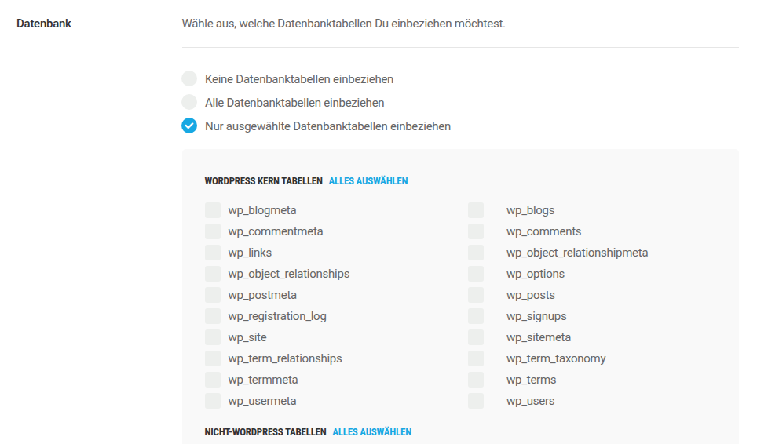

#### Häufigkeit

Standardmäßig ist Snapshot auf „Einmalig" eingestellt, was einfach ein einmaliges Backup auf Abruf ist. Wähle **Täglich, wöchentlich oder monatlich ausführen**, wenn du automatische Backups in regelmäßigen Abständen planen möchtest.

Verwende die Dropdown-Menüs, um die Häufigkeit (täglich, wöchentlich, monatlich), den Wochentag und die Tageszeit auszuwählen, zu der dein Backup stattfinden soll.

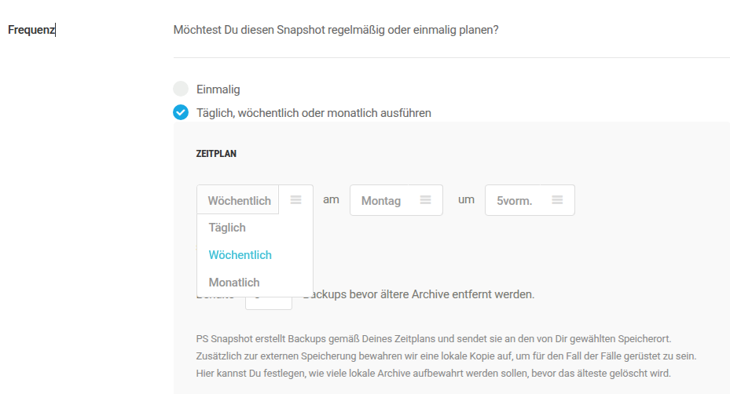

**Remote-Speicherlimit**

Wenn du wiederkehrende Backups für Remote-Speicherorte planst, hast du die Option, alle von Snapshot erstellten Backups zu behalten oder sie auf eine bestimmte Anzahl zu begrenzen. Sobald das Limit erreicht ist, beginnt Snapshot, die älteste gespeicherte Kopie durch das neue Backup zu überschreiben.

Wähle „Alle Snapshots behalten", um alle von Snapshot erstellten Backups zu speichern. Wähle „Eine bestimmte Anzahl von Snapshots behalten und die ältesten entfernen" und gib dann die gewünschte Anzahl von Backups in das bereitgestellte Feld ein.

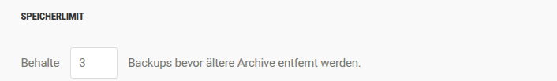

**Lokales Speicherlimit**

Du hast die Option, alle in der Cloud gespeicherten Backups zu behalten oder sie auf eine bestimmte Anzahl zu begrenzen. Sobald das Limit erreicht ist, ersetzt Snapshot die älteste gespeicherte Kopie durch die neue Kopie.

Wähle „Alle Snapshots behalten", um alle lokalen Backups zu speichern, die Snapshot erstellt, oder wähle „Eine bestimmte Anzahl von Snapshots behalten und die ältesten entfernen" und gib dann die gewünschte Anzahl von Backups in das bereitgestellte Feld ein.

Aktiviere auch \"Jetzt ein Backup ausführen\", um ein sofortiges Backup auszuführen, oder deaktiviere die Funktion, um das Backup bis zur geplanten Zeit zu verzögern.

#### Name, Speichern, Ausführen

Gib einen Namen für den aktuellen Snapshot in das bereitgestellte Feld ein, wobei du bedenken solltest, dass Snapshot automatisch ein Datum und eine ID zu diesem Namen hinzufügt. Wenn du mit der aktuellen Konfiguration zufrieden bist, klick auf \"Speichern und Backup ausführen\", um den Snapshot auszuführen.

Die Zeit zum Abschluss des Backups variiert zwischen wenigen Minuten und einigen Stunden, je nach Größe der Website.

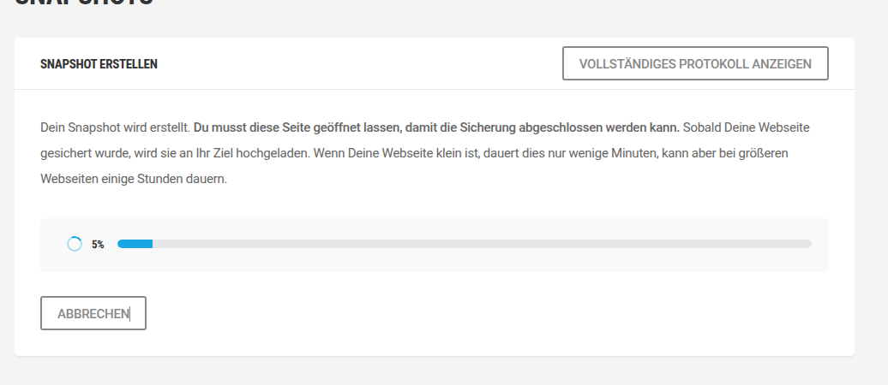

Wenn das Backup abgeschlossen ist, wird eine ZIP-Datei zum ausgewählten Ziel hochgeladen.

#### Verfügbare Snapshots

Nachdem du deinen ersten Snapshot erstellt hast, erscheint ein neues Modul – Verfügbare Snapshots – im Reiter Snapshots und zeigt eine Liste der für die konfigurierte Website erstellten Snapshots zusammen mit anderen wichtigen Daten an.

Verwende den Filter oben im Fenster, um Snapshots nach Ziel zu sortieren.

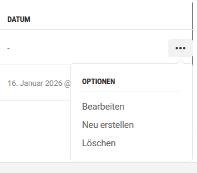

##### Optionsmenü

Die drei Punkte rechts neben einem Backup öffnen das Optionsmenü. Das Optionsmenü enthält:

**Bearbeiten** – Klick, um auf die Konfiguration eines Snapshots zuzugreifen und diese zu ändern.
**Neu generieren** – Klick, um das zuletzt erstellte Backup mit einer aktuellen Kopie zu überschreiben.
**Wiederherstellen** – Klick, um den Restore-Assistenten zu öffnen und mit der Wiederherstellung einer Website aus einem Backup zu beginnen, wie im Abschnitt „Wiederherstellen eines Backups" unten erläutert.
**Löschen** – Klick, um ein Backup zu löschen.

Verwende Massenaktionen, um mehrere Snapshots gleichzeitig zu löschen.

## 1.3 Speicherorte

### Speicherorte verstehen

Ein Ziel ist ein Ort, wo Snapshot-Backups gespeichert werden, und es gibt zwei Formen: lokal und remote (Drittanbieter).

### Lokales Ziel

Das Standard-Ziel ist „Lokal". Lokale Backups werden auf demselben Server wie deine Live-Website gespeichert und eignen sich perfekt zum schnellen Zurückrollen von Änderungen, was während der Entwicklung nützlich ist. Lokale Backups werden nicht für die Wiederherstellung nach einem Hack empfohlen. Da der Server, auf dem deine Website gehostet ist, kompromittiert wurde, könnte jedes Backup auf diesem Server infiziert sein.

### Konfigurieren

Lokale Backups werden auf deinem Server hier gespeichert: public_html/wp-content/uploads/snapshots/.

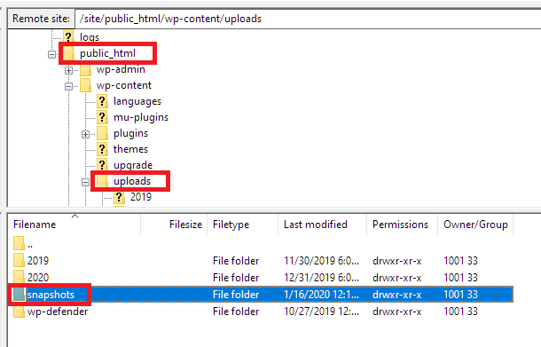

Du kannst das Verzeichnis, in dem deine Snapshot-Backups gespeichert werden, ändern, indem du auf **Konfigurieren** im lokalen Modul klickst.

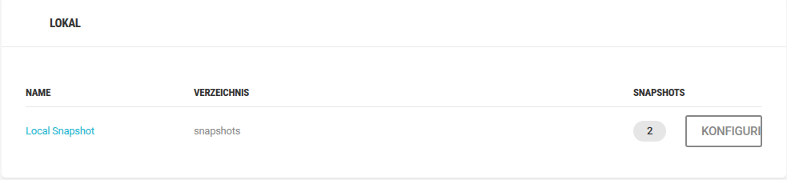

Der Name des lokalen Verzeichnisses „Lokaler Snapshot" kann nicht geändert werden, aber der Verzeichnispfad kann in jeden Ordner auf deinem Server geändert werden, indem du den Pfad in das bereitgestellte Feld eingibst und auf \"Ziel speichern\" klickst.

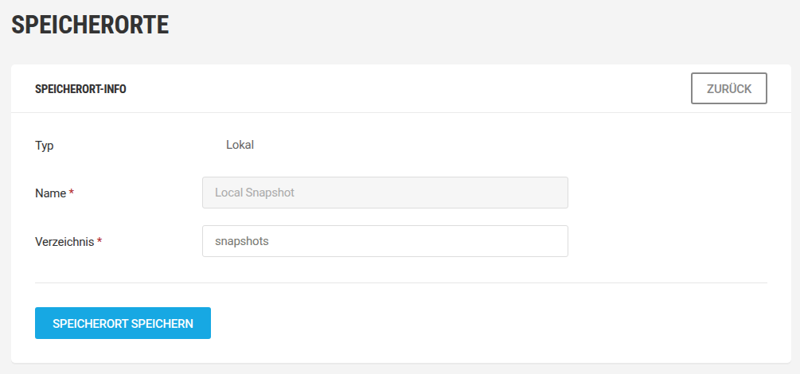

### Remote-Speicherorte

PS Snapshot unterstützt vier Remote-Speicherziele, die mit den Anweisungen in diesem Abschnitt verbunden werden können: Dropbox, Google Drive, AmazonS3 und FTP/SFTP.

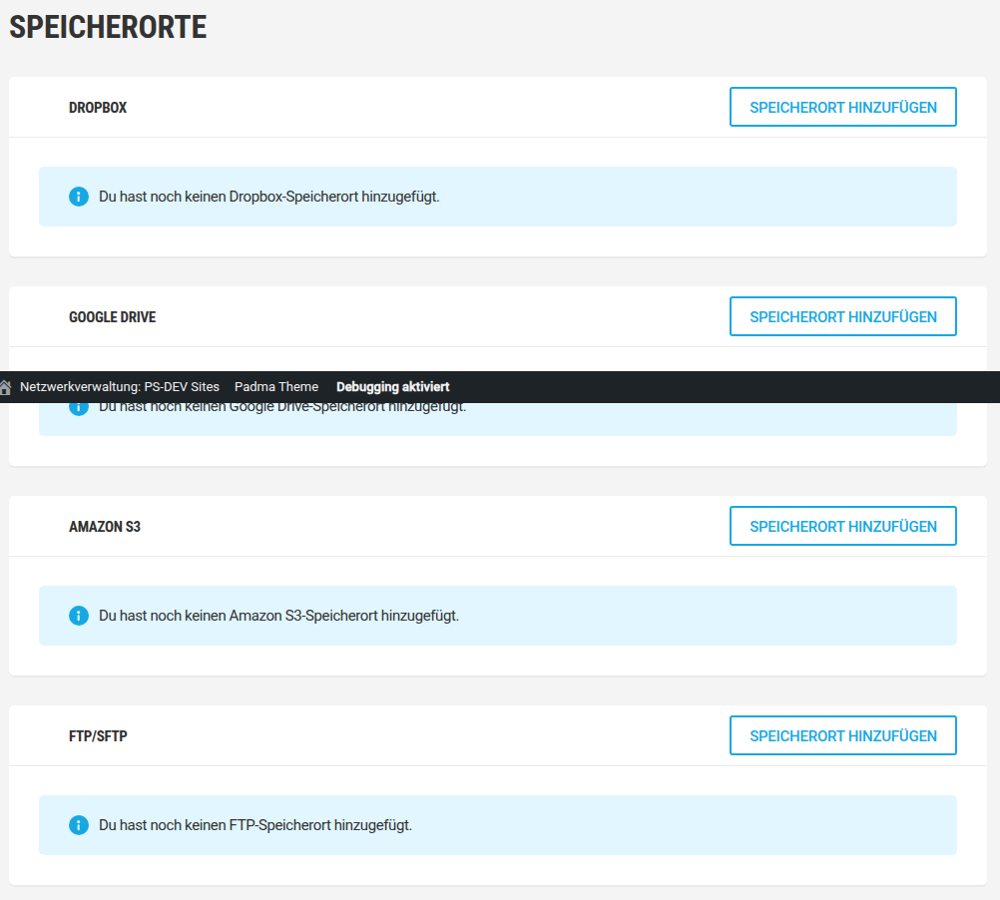